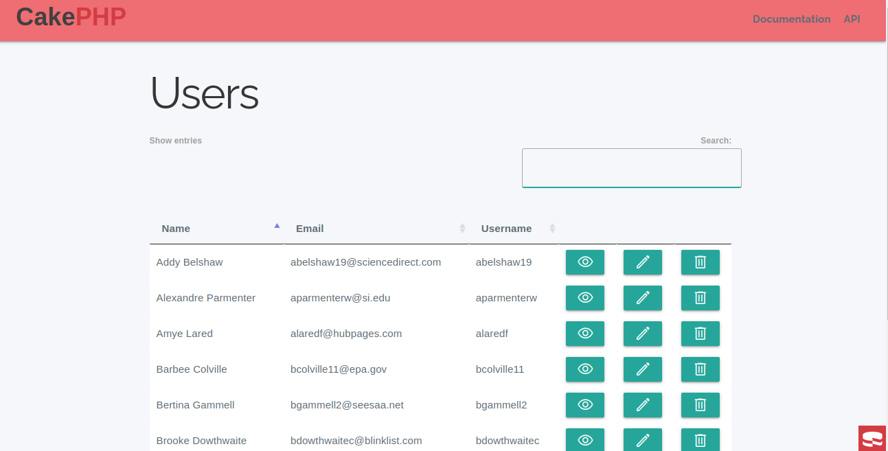
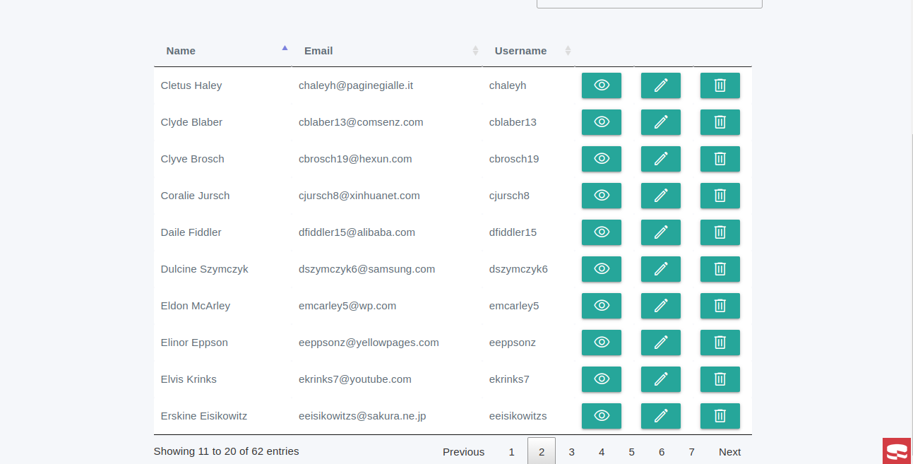
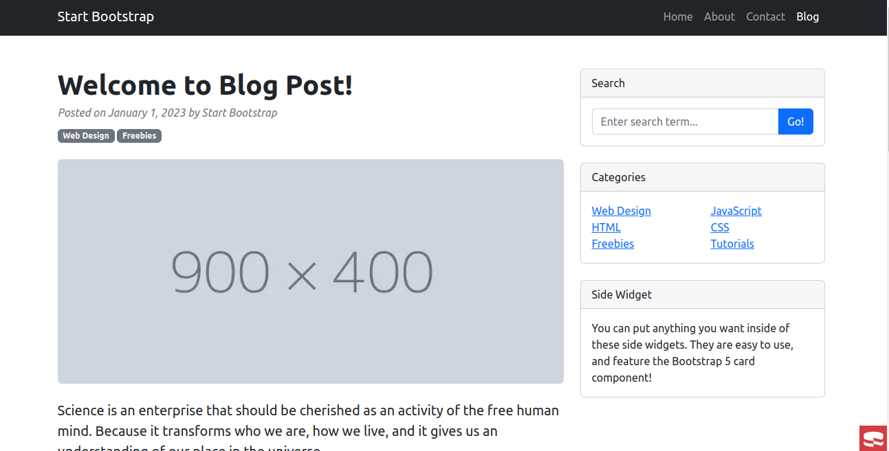

<h1 align="center">Cake Website</h1>

<h2 align="center">Project made using Cake PHP Framework</h2>

  

I did it on linux Ubuntu 22.04 using PHP 8.2, MYSQL and Apache

Download the Project on <b>/var/www/html</b>

On your SGBD run

<code><b>CREATE DATABASE cake_website;</b></code>

Update your database credentials on <b>config/app_local.php</b>

Go to the project directory

<code><b>cd /var/www/html/CakeWebsite</b></code>

Run the migrations to build the schema

<code><b>bin/cake migrations migrate</b></code>

There are some dummy inserts on folder <b>sql</b> for test purposes

  Classes here:
  <a href="https://www.udemy.com/course/draft/2119762/learn/lecture/13104024?start=15#overview">
    Curso de CakePHP 3
  </a>

  
  
  

